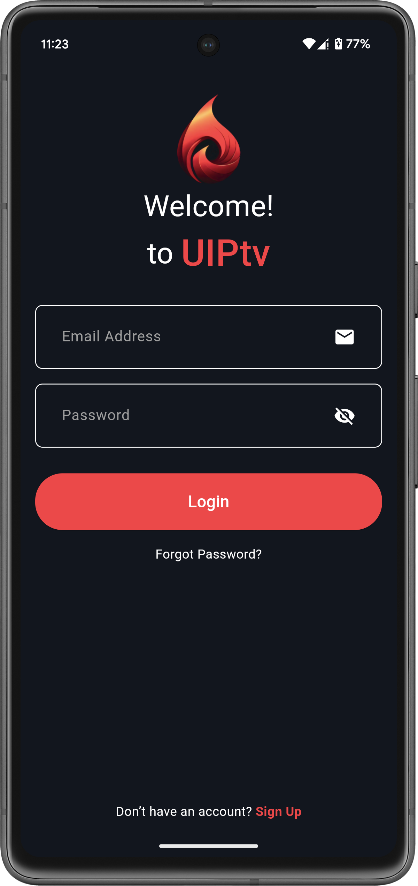
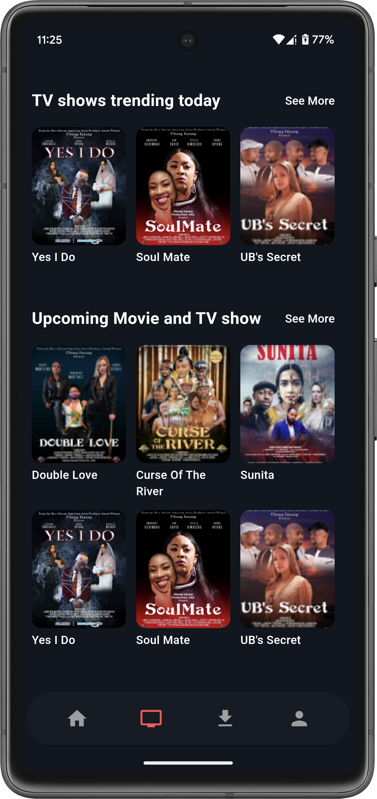

## 📺 UIP TV – Free TV App (Full Source Code)  
UIP TV is an awesome Flutter UI project that provides a complete streaming app experience. It includes all essential pages and features, such as: 

✅ Login & Signup 
✅ Subscription Management 
✅ Home Screen 
✅ TV Shows & Categories 
✅ Downloads & Offline Viewing 
✅ User Profile & Settings 

Built with Flutter, this project serves as a great starting point for your own TV or streaming app. Feel free to explore, customize, and enhance it! 🚀 

🔧 Tech Stack 
- Flutter (Dart) 
- Responsive UI 
- Modern & Clean Design 

## 🌟 Screenshots

  
  
  

  
  
  

